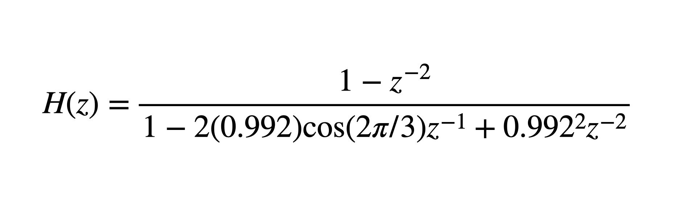

# exon-pred-svd 

A Rust program that predicts protein-coding regions in a DNA sequence based on Singular Value Decomposition (SVD). 

[](https://github.com/shin-kinos/exon-pred-svd/releases/tag/v0.1.1) [](https://github.com/shin-kinos/exon-pred-svd/blob/main/LICENSE) 

## Description 

* A Rust program that predicts exons and introns in a DNA sequence. 
* The input data must be a DNA sequence in FASTA format. 
* The analyzing measure is based on anti-notch infinite impulse response (IIR) filtering and SVD. 

## Dependencies 

### peroxide (version `0.31` or more) 

* `peroxide` (https://docs.rs/peroxide/latest/peroxide/) 

``` 
[dependencies]
peroxide = "0.31"
``` 

## Installation 

You can compile this program by using `Cargo`. 🦀📦 

[e.g] 

``` 
% cd exon-pred-svd-main
% cargo build --release 
``` 

Then, the object file `exon-pred-sdv` is generated in `./target/release/` directory. 

## Methods  

### Numerical representation 

To apply a Digital Signal Processing, a DNA sequence composed of 4 types of base represented by { `A`, `T`, `C`, `G` } letters should be converted into a numerical one. This program assigns a numerical mapping value to each base with the one-dimensional numerical representation method. 

This program follows **4** types mapping values assigned as follows (Table. Ⅰ) : 

Table. Ⅰ Mapping techniques. 

|                    | Adenine (`A`) | Thymine (`T`) | Cytosine (`C`) | Guanine (`G`) |
|               ---: |     :---:     |     :---:     |     :---:      |     :---:     |
|           EIIP [1] |     0.1260    |     0.1335    |     0.1340     |     0.0806    |
|        Integer [2] |     2         |     0         |     1          |     3         |
|    Pseudo EIIP [3] |     0.1994    |     0.1933    |     0.0692     |     0.0123    |
| Paired numeric [4] |     1         |     1         |     -1         |     -1        |

### Filtering stage 

The purpose of the filtering stage is to emphasize 3-base periodicity by making peaks. This program employs anti-notch IIR filter with a center angular frequency of `2π/3` as follows [5]. 

 

### Exons and introns prediction using SVD 

Prior to apply the SVD analyzing, the filtered signal is rearranged into a 3 × *m* matrix ***A*** as follows.  

  

✅ NOTE that *m* must be a multiple of 3, based on [5].

Then, The SVD is applied to the filtered signal as follows [5]. 

 

Where ***A*** is rearranged 3 × *m* matrix of filtered signal, ***U*** and ***V*** are orthogonal square matrices of dimensions 3 × 3 and *m* × *m*, respectively. The highest *singular value* of that SVD reflects the degree of periodicity [5]. It is then processed on a moving frame basis. 

## Input file format 

A DNA sequence in FASTA format. ⚠️ NOTE that a Multi-FASTA format is NOT acceptable, means the input file MUST have just 1 DNA sequence. 

See an example input data in `./example/` directory. 

## Usage 

Major arguments : 

* `-i` : Input filename in FASTA format, REQUIRED. 
* `-o` : Output filename, REQUIRED. 
* `-f` : Frame size ( default `81` ). Note that this value MUST be a multiple of 3 ( e.g. `81`, `102` and `351` etc. ). 
* `-m` : Mapping method to convert a DNA sequence into a numerical one. 

Type `-h` to see the other available options. 

[e.g] 

``` 
% ./exon-pred-sdv -i sequence_FZ412301.fasta -o output.txt -f 351 -s yes -c no
``` 

## Output  

*DNA position* `\t` *Degree of periodicity*

## Additional data 

### MATLAB source code 

It is confirmed that the output result of the program is identical to a MATLAB's whose source code is on `./matlab/` directory. It would help you to see how this Rust program concretely works and it's algorithm in the whole process. 

### Result data visualization with R 

 

[Visit here !]( https://github.com/shin-kinos/exon-pred-svd/blob/main/r/lineplot_anim.r ) 👈👈👈 

## References 

1. Fickett, James W. "Recognition of protein coding regions in DNA sequences." Nucleic acids research 10.17 (1982).
2. Cosic, Irena. "Macromolecular bioactivity: is it resonant interaction between macromolecules?-theory and applications." IEEE Transactions on Biomedical Engineering 41.12 (1994). 
3. Ramachandran, Parameswaran, Wu-Sheng Lu, and Andreas Antoniou. "Optimized numerical mapping scheme for filter-based exon location in DNA using a quasi-Newton algorithm." Proceedings of 2010 IEEE International Symposium on Circuits and Systems. IEEE (2010). 
4. Buldyrev, S. V., et al. "Analysis of DNA sequences using methods of statistical physics." Physica A: Statistical Mechanics and its Applications 249.1-4 (1998). 
5. Akhtar, Mahmood, Eliathamby Ambikairajah, and Julien Epps. "Detection of period-3 behavior in genomic sequences using singular value decomposition." Proceedings of the IEEE Symposium on Emerging Technologies, 2005.. IEEE (2005). 
